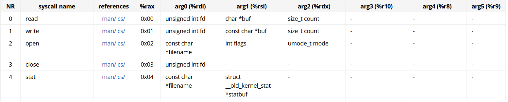

# 과제 

1. 어셈블리어로 된 프로그램을 분석해보세요 
```assembly
global    _start
section   .text
_start:
    mov       rax, 1
    mov       rdi, 1
    mov       rsi, message
    mov       rdx, 13
    syscall
    mov       rax, 60
    xor       rdi, rdi
    syscall
section   .data
message:
    db        "Hello, World", 10
```
위의 코드는 Hello world 라는 문장을 출력하는 코드로 2가지 섹션으로 나뉘어져 있다.

하나는 초기값을 가지는 변수를 저장하는 **data section** 이고
나머지는 레지스터와 메모리를 사용하는 **text section**이다.

먼저 data section에는 우리가 출력하고자 하는 데이터를 이름과 함께 저장해 놓는다. 
```
section   .data
message:
    db        "Hello, World", 10
```
현재 data section 에는 :message 라는 이름으로 Hello World라는 data가 들어있다.

assambly에서는 char 와 string의 구분이 없기 때문에 **"Hello World"**, **"Hello, World"** , **"Hello" ,"World"** 3가지 표현방식이 똑같으며 10은 개행을 의미한다. C언어의 \n과 비슷한 역할을 한다.

text section에서는 크게 2가지의 작업을 수행한다.
하나는 우리의 목적인 Hello World를 출력하는 작업과 나머지 하나는 프로그램을 정상 종료하는 작업이다.

먼저 Linux에서 문자를 출력할때 assembly는 System Call 을 이용한다.

우리는 출력을 하고자 하기 때문에 write이라는 이름의 SystemCall을 호출한다.

위의 표는 Syscall 표에 나와 있듯이 write은 rax,rdi,rsi,rdx 4개의 인자를 받으며 rax 값은 어떤애를 호출할 것인지, rdi 는 fd값, rsi는 data주소, rdx는 길이의 정보를 받는다.

start아래로 5줄이 이런 정보를 전달하는 부분이며 

rax 1이 write을

rsi, message가 data section에서 선언했던  변수 message의 주소를 

rdx, 13이 13개의 글자를 출력하라는 정보를 전달하게 된다.
위의 정보들을 

저장후 syscall을 호출하면 message로 부터 전달받은 Hello World를 출력하게 된다.

```
_start:
    mov       rax, 1
    mov       rdi, 1
    mov       rsi, message
    mov       rdx, 13
    syscall
```

아래의 코드는 프로그램을 종료하는 코드로서 
rax는 60은 exit()라는 SystemCall을 호출하는 값으로 syscall을 통해 호출된후 정상적으로 프로그램을 종료한다.
```
   mov       rax, 60
    xor       rdi, rdi
    syscall
```