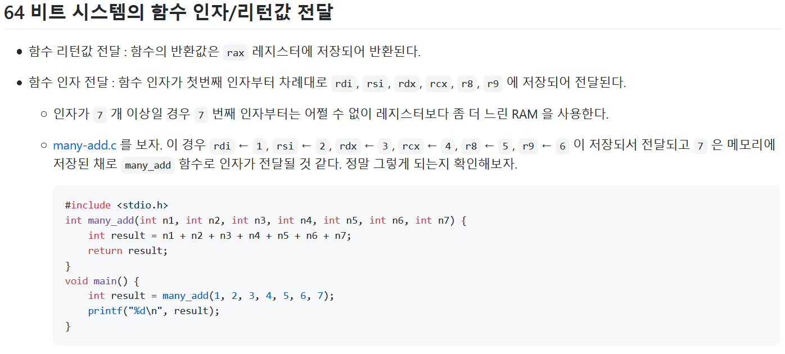
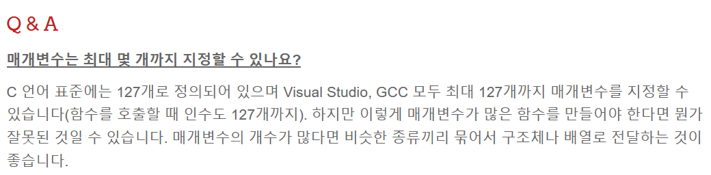
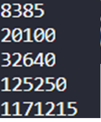
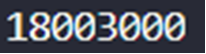
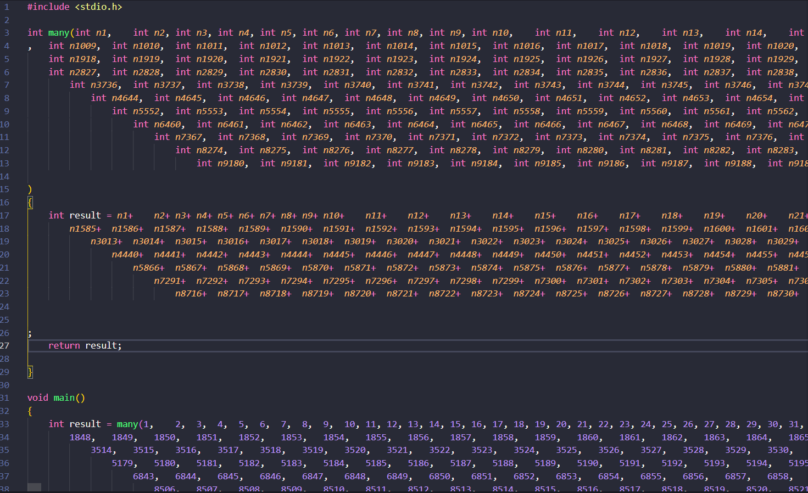
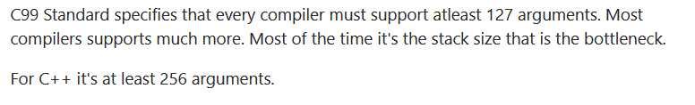

# 과제 

1. 자신의 실험 결과에 대한 write-up 을 쓰세요. 

    - 사람은 어떤 학문을 이해하든지 간에 그 학문이 정말로 맞는지 확인하기 위해 자신만의 실험을 하기 마련이다. 특히 컴퓨터 공학은 그러한 실험이 많이 일어나는데 어제의 내용과 오늘의 내용을 이해하기 위해서 자신이 했던 생각이나 의문이나 고민을 write-up 에 작성하고 그 생각과 의문과 고민을 해결하기 위해서 시도했던 실험과 실험 결과를 write-up 에 작성하시오. 
  
    # 소소한 의문: 함수 paramater 한계는?

    
     위의 글을 읽으면서 함수 paramater가 레지스터와 RAM 메모리를 같이 쓴다는 것을 알게 되었다. 
     paramater의 개수가 6개 이하이면 레지스터를 7개 이상이면 RAM메모리를 쓴다고 말이다. 

     여기서 든 의문이 그럼 함수의 paramater은 최대 몇 개까지 전달 될 수 있나? 라는 것이었다.

     RAM에 저장할 수 있는 한계 만큼 전달할 수 있는지 아니면 보통 그렇게 많은 paramater가 필요할리 없기 때문에 제한을 해두었나? 라는 생각을 했습니다.

     1차적으로 인터넷에 검색해 보았을 때
     
     최대 127개라는 답을 얻었습니다.

     그래서 진짜 127개가 맞는지 확인하고자 
     위에 주어진 many_add 함수의 인자를 127개로 늘리고 더하는 함수를 작성하였습니다.
     ```c
     #include<stdio.h>
     int many(int n1, int n2,....int n127)
     {
         int result = n1+n2+....n127;
         return result;
     }
    void main()
    {
        int result =many(1,2,...127);
        printf("%d\n",result);
    }
    ```
    결과로 

    

    이라는 결과가 잘 나왔습니다.
    하지만 128개의 인자를 넣었을때도 정상적으로 결과가 나왔습니다.
    그래서 적당한 숫자에 숫자의 인자를 추가하여 계속 실험해 본 결과

    

    1530까지

    

    6000개

    

    10000개
    

    인자 10000개까지 정상적으로 전달하는 것을 볼 수 있었습니다.

    해서 다시 찾아본 결과 

    
    
    최소 127개라는 정보를 얻을 수 있었습니다.
    해서 stack사이즈 만큼 올라 갈 수 있지 않을까라는 결과를 얻게 되었습니다.
