# 과제 

crackme 0x00b : wOwgreat
crackme 0x01 : 5274
crackme 0x02 : 338724
crackme 0x03 : 338724

1. crackme0x04 을 풀고 write-up 을 쓰세요. 
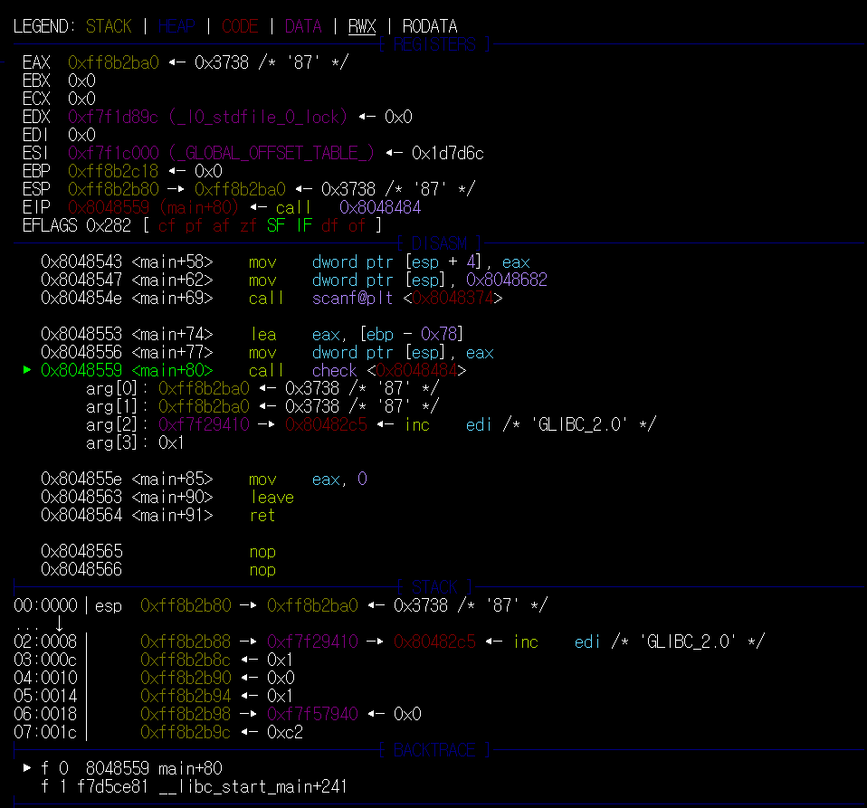

 crackme0x04에서는 main 함수에서는 password만 입력받고 그림과 같이 check함수를 호출하여 password를 검사한다.
 87이라는 숫자를 입력하였다.
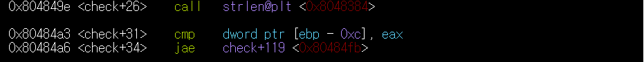

check 함수 내부에서는 입력받은 문자열의 글자 개수를 strlen이라는 함수를 이용하여 counting하고 그 수에 맞게 반복한다.
위의 그림은 87이라는 숫자를 입력받았기 때문에 최대 2번 반복할것이다

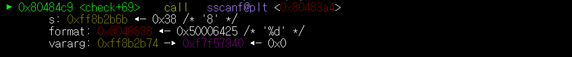

check함수 내부에서는 sscanf라는 함수를 호출하여 문자열로 입력된 87에서 1글자만 떼어내 숫자로 변환한다.
변환된 숫자는 ebp-4라는 주소에 저장된다.

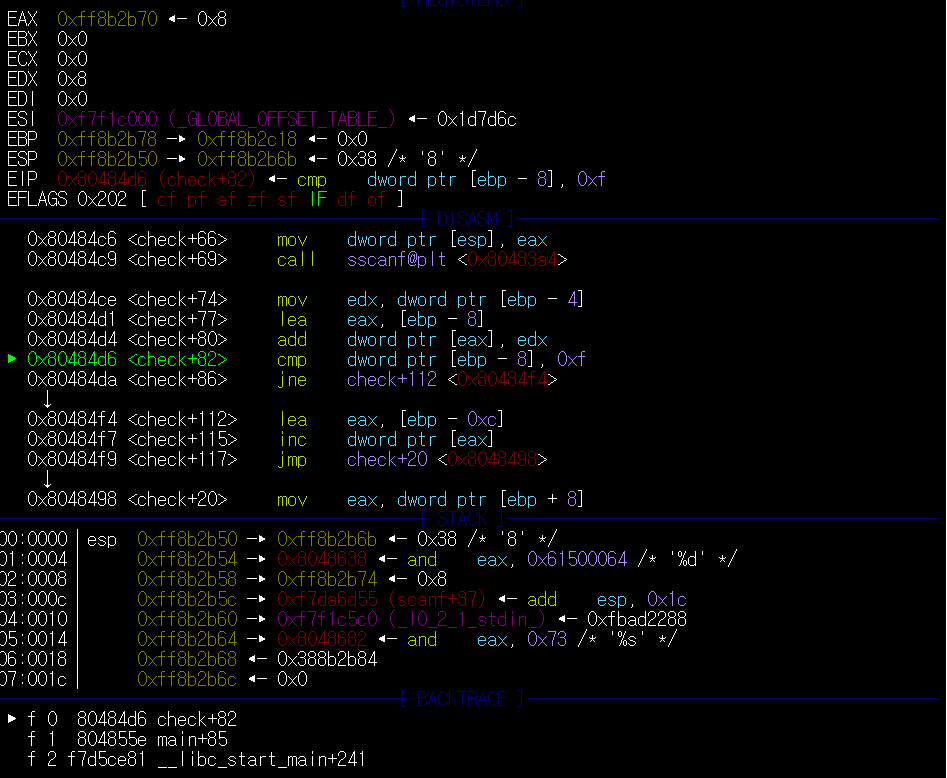

mov edx, [ebp-4] 를 이용하여 edx에 변환한 숫자를 저장하고

lea eax,[ebp-8]을 이용하여 eax와 [ebp-8]의 주소를 연결하고

add eax, edx를 이용하여 변환된 숫자를 더한다.

그 후 더해진 수가 0xf가 맞는지 확인한다.

만약 맞다면 다음줄로 이동하게 되지만 현재 0x8 != 0xf 이므로 check+112번 줄로 이동후 다시 check+20번줄로 이동하여 위의 과정을 반복한다.

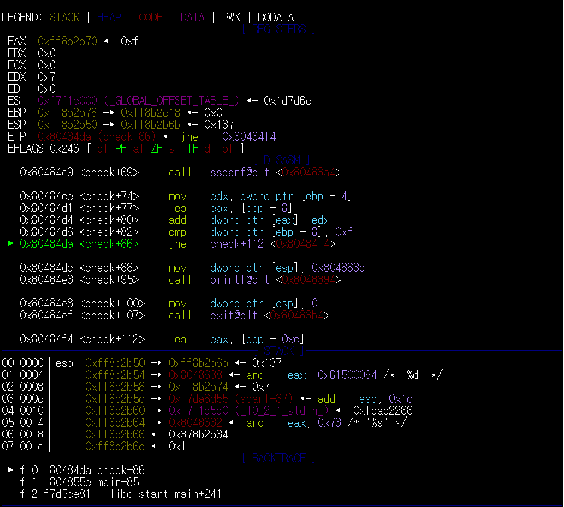

2번째 실행에서 sscanf로 7의값을 변환하고 저장되어있던 8과 더하게 되면

0xf == 0xf를 만족하게 된다.

따라서 check+112번 줄로 이동하지 않고 다음 줄로 이동하여 Password ok!라는 문장을 출력한다.

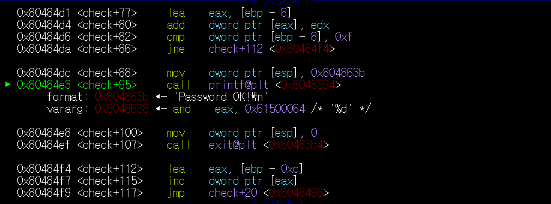

위의 방식은 단순히 입력 받은 문자 만큼 반복하며 문자를 숫자로 변환한 만큼 더하여 0xf라는 수가 된다면 Password Ok라는 문장을 출력한다.
따라서 정답은 더하여 0xf라는 값을 만들어낼 수 있는 모든 값들이다.
  
   답:

     111111111111111
     96
     87

또한 전부 더할 필요 없이 왼쪽부터 더하여 0xf를 만들어되 된다.

    87324234
    96asdf
    78asdf

2. crackme0x05 을 풀고 write-up 을 쓰세요. 

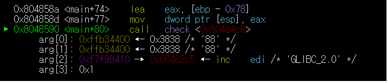

crackme0x05은 crackme0x04과 거의 똑같은 방식을 사용한다. 

마찬가지로 main 함수에서는 문자열만 입력 받고 검사는 check라는 함수에서 하게 된다.

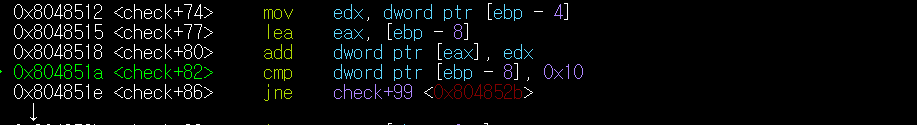

다른점은 check 함수에서의 값이 0x04에서는 0xf였다면 0x05에서는 0x10이다.

더해서 0x10이라는 조건을 만족할 수 있다면 1차 분기점을 넘어 간다.

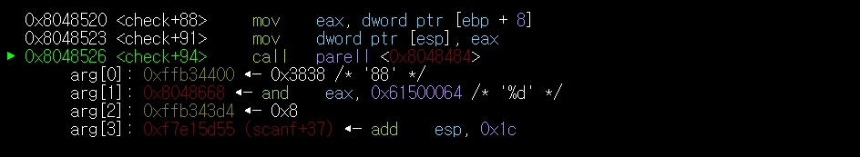

그 후 parell이라는 함수를 만나게 된다.

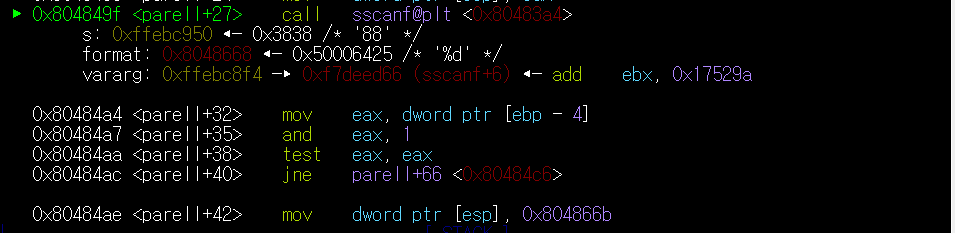

parell함수에서는 더해서 16을 만들 수 있는 수 중에서 똑같은 숫자로만 이루어져 있는 문자열만을 정답으로 인정한다. 

    88
    4444
    22222222
~~이유는 모르겠지만 1111111111111111은 정답으로 인정되지 않는다.~~

정확히 어떤 방식을 거쳐 변환되는지까지는 확인을 하지 못하였지만,
parell함수에서는 sscanf함수를 이용하여 전달받은 문자열을 변환한다.

변환된 숫자는 1과 and 연산을 하여 만약 똑같은 숫자로만 이루어져 있다면 0이라는 값을 아니라면 1이라는 값을 만들어낸다.
그 후 test eax, eax를 통하여 0이라는 정답을 향하여 0이 아니라면 parell+66으로 이동하여 오답이라는 것을 출력하게 된다.

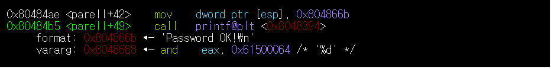
