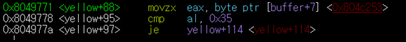

# HoweWork-5

## easyelf


먼저 easyelf라는 프로그램을 실행시켜 어떤식으로 동작하는지 확인합니다.

easyelf는 Reversing.Kr Easy ELF라는 문장을 출력하고 입력을 받는다는 것을 확인 할 수 있었습니다.


gdb를 실행시킨 후
**i function** 명령어를 이용하여 easyelf의 함수를 확인 합니다.

__libc_start_main이라는 함수를 break point로 지정 후 디버깅을 시작합니다.


Reversing.Kr Easy ELF라는 문장을 출력하고 입력을 받을때 까지 main 함수를 실행시켜보니 

main+140에서 0x8048580이라는 함수를 호출 후 해당 기능이 실행되는 것을 확인 하였습니다.


**si** 명령어를 이용하여 해당 함수로 들어가니 

첫번째 call 에서 문장을 출력하고

두번째 call 에서 문장을 입력받는다는 것을 확인했습니다.


asdf라는 간단한 문장을 입력 후 진행합니다.

계속 해당 함수를 진행 나가니 3번째 call 을 지나친 후 eax값을 비교하여 eax가 1이 아닐 경우  


wrong 문자를 출력하며 프로그램이 종료되는 것을 확인했습니다.

따라서 세번째 call이 문장에 일치 여부를 판단하는 함수라고 예상하고 3번째 call 에 내부 함수 탐색 하였습니다.


3번째 call 내부 함수로 들어오니 0x804a021 이라는 주소에서 1byte를 받아와 0x31과 비교하는 문장을 확인할 수 있었습니다.

**x/c 0x804a021** 명령어를 이용하여 해당 주소에 's' 라는 문자가 들어있는 것을 확인 하였습니다.

따라서 0x804a021에 asdf 중 2번째에 해당하는 정보를 가지고 있다는 것을 확인 후 0x804a020부터 문자열이 저장되어있다는 것을 확인 하였습니다.

2번째 자리가 0x31(아스키 코드 :1)이라는 값을 가진다는 것을 확인 후 

```
set $ZF = 6
set $eflags |= (1 << $ZF)
```
명령어를 이용하여 해당 분기를 건너 뜁니다.


다음 문장에서 

0x804a020,0x804a022,0x804a023

각각 문장의 첫번째, 3번째, 4번째에 해당하는 글자를 xor연산을 통하여 변환 후 각자의 자리에 저장하는 것을 확인 할 수 있었습니다.


그 후 문장의 다섯번째 자리수의 값이 0x58(아스키 코드 : X)인지 확인 후 넘어가는 문장이 나옵니다. 마찬가지로


```
set $ZF = 6
set $eflags |= (1 << $ZF)
```

명령어를 이용하여 넘어간 후


3번째 글자를 0x7c와


1번째 글자를 0x78과


4번째 글자를 0xdd와


비교 후 넘어가는 문장이 나옵니다. 


이 모든 것들을 넘어가니 


라는 문장이 나오는 것을 확인할 수 있었습니다.
따라서 

1번째 글자 xor 0x34 = 0x78

3번째 글자 xor 0x32 = 0x7c

4번째 글자 xor 0xffffff88  = 0xdd 
> 여기서 xor연산 후 1byte만 저장을 하였기 때문에 0x88이라고 봐도 무방하다.

0x78 xor 0x34 = 0x4c(아스키 코드 : L)

0x7c xor 0x32 = 0x4e(아스키 코드 : N)

0xdd xor 0x88 = 0x55(아스키 코드 : U)

라는 것을 알 수있다.

따라서 
|1번째|2번째|3번재|4번째|5번째|
|------|---|---|---|---|
|0x804a020|0x804a021|0x804a022|0x804a023|0x804a024|
|0x4c|0x31|0x4e|0x55|0x58|
|L|1|N|U|X|

라는 결과를 얻을 수 있다.


## Bomb


함수를 분석해보니 main과 yellow 함수가 있는것을 확인 할 수 있다.

풀어야하는 선이 yellow선이기 때문에 해당 함수에 break point를 설정 후 실행 시켜보았다. 


asdf라는 값을 입력후 


만난 첫번쨰 분기에서 0x38과 buffer에 값을 비교하는 것을 확인 할 수 있다. 

eax에 들어있는 값이 0x61(아스키 코드 : a) 에 해당하는 값이기 때문에 입력한 첫번째 글자와 0x38 (아스키 코드 : 8 )에 값을 비교하는것을 확인 할 수 있다. 

따라서 해당 분기를

```
set $ZF = 6
set $eflags |= (1 << $ZF)
```
이용하여 넘어가면 


eax 값 0x73(아스키 코드 : s)와 0x34(아스키 코드 : 4)에 값을 비교하는 것을 확인할 수 있다. 마찬가지로 계속 내려가다보면




총 8번의 값을 비교하는 구문이 나온것을 알 수 있다. 

값들을 정리해 보면


|1번째|2번째|3번재|4번째|5번째|6번재|7번째|8번째|
|------|---|---|---|---|---|---|---|
|0x38|0x34|0x33|0x37|0x31|0x30|0x36|0x35|
|8|4|3|7|1|0|6|5|

이 된다는 것을 확인 할 수 있다.


도출해낸 값을 다음과 같이 입력하면 노란선이 제거된 것을 확인할 수 있다.