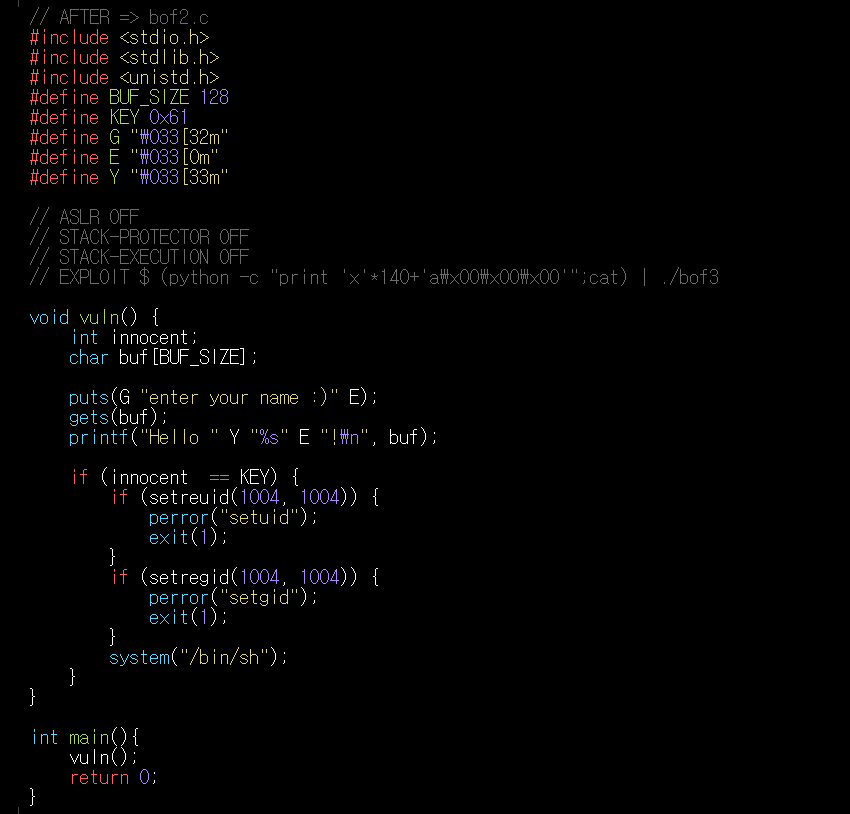
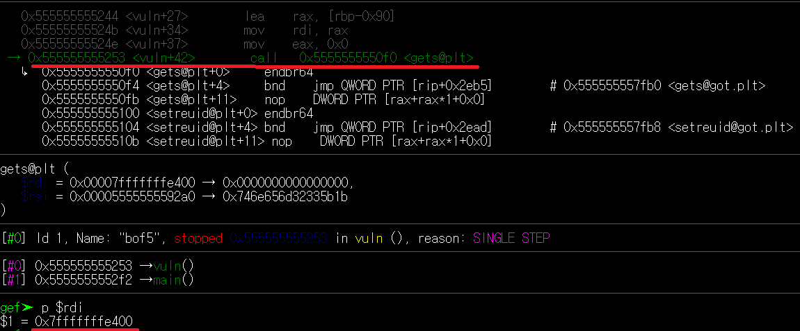
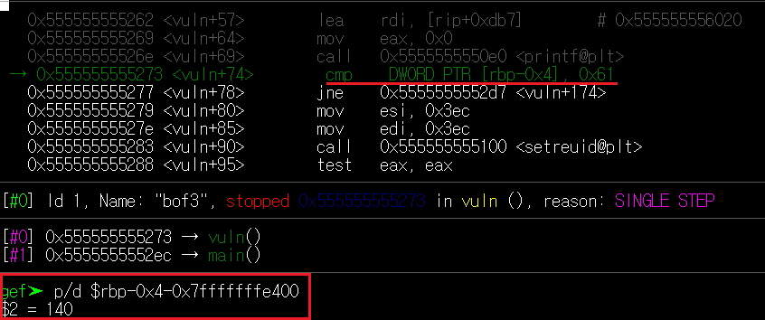
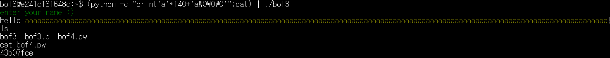
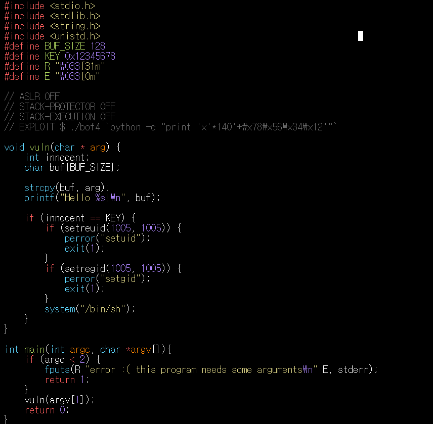
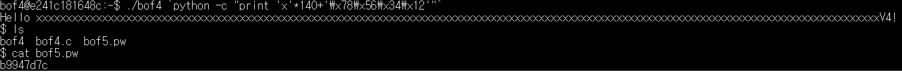
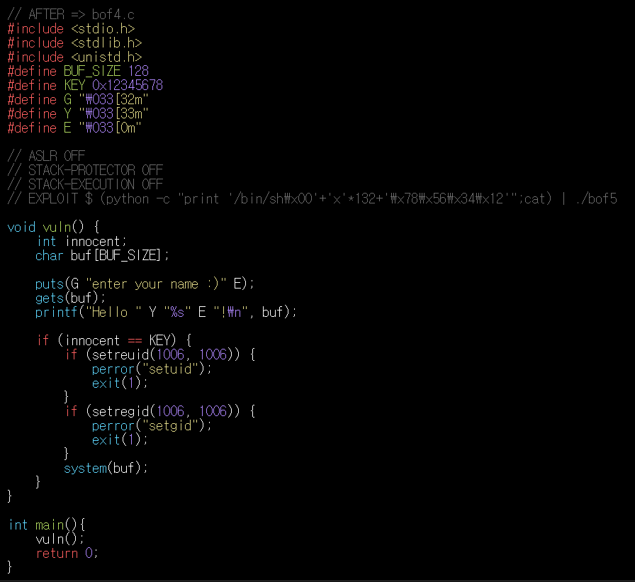
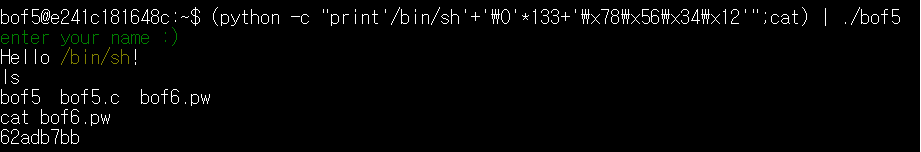

# 과제 

## BOF3
### 취약점 분석



bof3파일은 gets함수를 이용하여 받은 데이터를 바로 buf에 저장한다.
따라서 버퍼 오버플로우가 발생할 수 있다.

system을 실행시키려면 innocent에 key(0x61)값을 넣어야 한다.

gdb를 통하여 해당 구문을 분석한다.



get함수가 불려지는 곳으로가 데이터가 저장되는 시작 위치를 찾는다.

    p $rdi = 0x7fffffffe400 

key 0x61과 innocent가 맞는지 확인하는 구문

```cmp DWORD PTR[rbp-0x4],0x61```
을 통하여 buff와 innocent 사이의 크기를 구한다.



140이라는 값이 나왔다. 따라서 140이상의 데이터가 들어가면 그때는 data가 innocent에 들어가는 것을 알수있다.

### 권한 탈취



버퍼 오버플로우를 일으키기 위하여

140개의 의미없는 data와 key값을 넣는다. key값은 0x61이기 때문에 0x61이라는 값을 가지는 아스키 코드 a와 나머지는 0으로 채워준다.
>litte endian방식을 사용하기 때문에 a가 먼저 들어간다.

```shell
(python -c "print 'a'*140 +'a\0\0\0'";cat)  | ./bof3
```

## BOF4
### 취약점 분석



bof4에서는 main에서 전달 받은 인자를 strcpy를 통하여 바로 buf에 저장하기 때문에 버퍼 오버플로우가 발생할 수 있다.

bof3와 동일한 과정을 통하여 innocent와 buf에 사이가 140이라는 것을 확인한 후 innocent위치에 key(0x12345678)값이 들어 갈수 있도록 입력한다.

### 권한 탈취



```shell
 ./bof4 `python -c "print 'a'*140 +'\x78\x56\x34\x12'"`   
```
bof4는 main함수에서 받은 인자를 strcpy하는 것이기 때문에 ``을 이용하여 데이터를 전달한다.

key값은 0x12345678이다. 지금까지 입력을 할때는 문자를 아스키 코드로 바꿔 해당하는 값을 입력하였다. 하지만 0x12345678이라는 값은 존재하지 않기 때문에 입력에 hex값을 직접 입력해 주어야 한다.

처음에는 안될걸 알지만 혹시 몰라

    '12345678','0x12345678','78563412' 등 

위와 같이 입력을 해 보았으나 역시 실행이 되지 않았다.

따라서 hex값을 직접 입력하기 위하여 찾아본 결과 print "\x78" 글자 안에 \x를 넣게 되면 hex값이 직접 들어가게 된다는 것을 알게 되었다.

https://m.blog.naver.com/kby88power/220724987471

해서 little endian 방식으로 저장이 된다는 것을 고려해 key값으로 ***\x78\x56\x34\x12***의 값을 넣자 잘 권한을 가져왔다는 것을 확인할 수 있다.


## BOF5
### 취약점 분석



bof5을 분석해보면 bof3와 거의 같지만 system에서 직접 /bin/sh를 호출하는 것이 아닌 buf를 통하여 전달을 받는다. 
따라서 단지 아무 의미없는 값을 넣어 오버 플로우를 일으키는게 아닌 system이 buf를 통해 /bin/sh를 호출하고 innocent에 key값이 들어 갈 수 있도록 해야한다.

### 권한 탈취




bof5에서는 get함수를 이용하여 데이터를 전달받기 때문에 | 이용하여 작성한다.

sytem이 buff에서 /bin/sh를 읽어올 수 있도록 데이터를 전달한다.

처음에는 그냥 /bin/sh만 전달하면 되지 않을까라는 생각에 

/bin/sh 7글자를 20번 반복시켜 140개를 채웠지만 /bin/sh가 20번 반복되면 전혀 다른 문장이 되기 때문에 실패했다.

따라서 /bin/sh 7글자를 채우고 나머지 133글자를 \0 을 이용하여 채우니 buf에 원하는데로 /bin/sh가 들어가 권한을 탈취했다.

```
(python -c "print'/bin/sh'+'\0'*133+'\x78\x56\x34\x12'";cat) | ./bof5
```